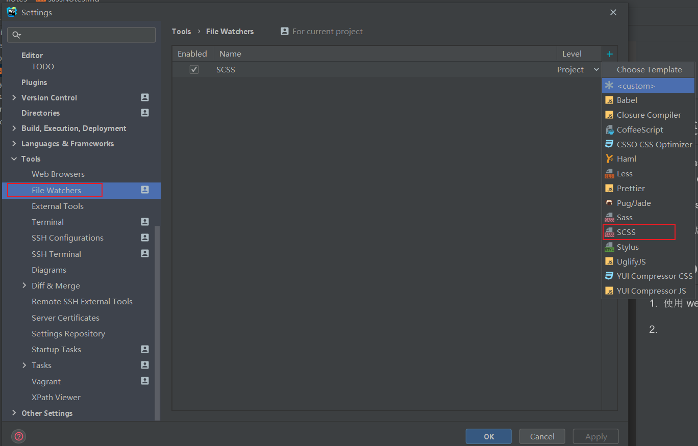
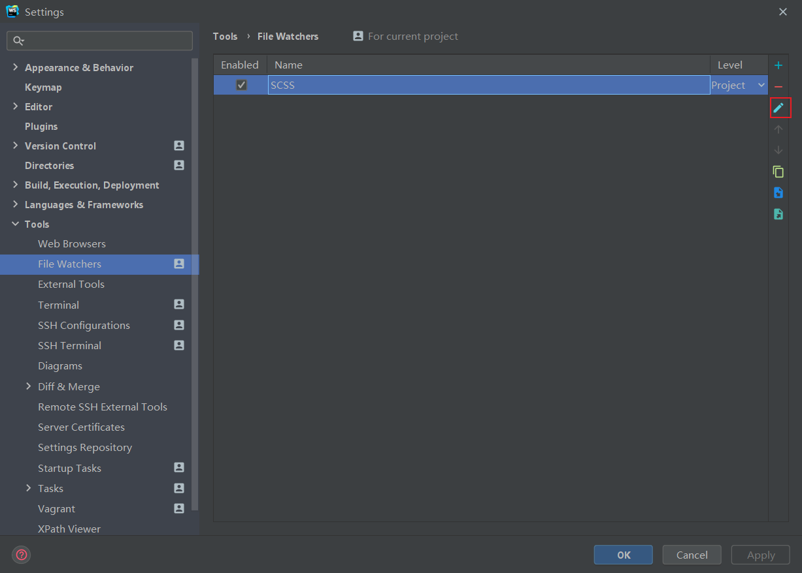
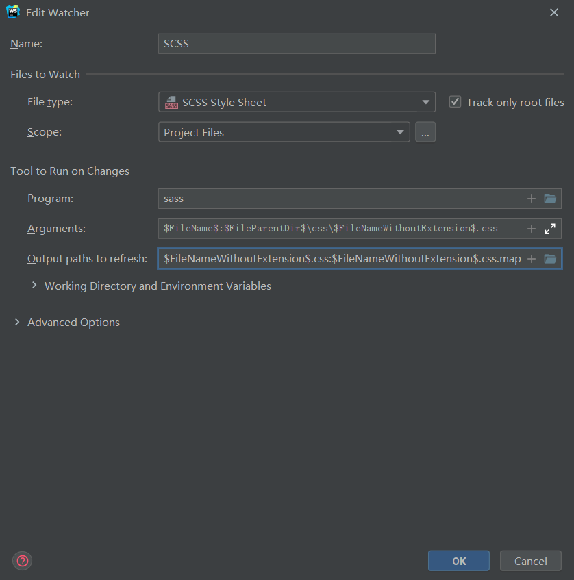

<!-- START doctoc generated TOC please keep comment here to allow auto update -->
<!-- DON'T EDIT THIS SECTION, INSTEAD RE-RUN doctoc TO UPDATE -->
**Table of Contents**  *generated with [DocToc](https://github.com/thlorenz/doctoc)*

- [Sass 学习笔记](#sass-%E5%AD%A6%E4%B9%A0%E7%AC%94%E8%AE%B0)
  - [1. sass 基本知识](#1-sass-%E5%9F%BA%E6%9C%AC%E7%9F%A5%E8%AF%86)
  - [2. 安装 sass](#2-%E5%AE%89%E8%A3%85-sass)
  - [3. webstorm 配置 sass 自动编译](#3-webstorm-%E9%85%8D%E7%BD%AE-sass-%E8%87%AA%E5%8A%A8%E7%BC%96%E8%AF%91)
  - [4. sass 基本语法](#4-sass-%E5%9F%BA%E6%9C%AC%E8%AF%AD%E6%B3%95)
    - [1. 变量](#1-%E5%8F%98%E9%87%8F)
    - [2. 注释](#2-%E6%B3%A8%E9%87%8A)
    - [3. 插值 -- `#{}`](#3-%E6%8F%92%E5%80%BC----)
    - [4. 嵌套](#4-%E5%B5%8C%E5%A5%97)
    - [5. 四则运算](#5-%E5%9B%9B%E5%88%99%E8%BF%90%E7%AE%97)
    - [6. 数据类型](#6-%E6%95%B0%E6%8D%AE%E7%B1%BB%E5%9E%8B)
    - [7. 混合 -- `@mixin` 与 `@include`](#7-%E6%B7%B7%E5%90%88----mixin-%E4%B8%8E-include)
    - [8. 继承 -- `@include`](#8-%E7%BB%A7%E6%89%BF----include)
    - [9. 导入 -- `@import`](#9-%E5%AF%BC%E5%85%A5----import)
    - [10. 内置函数](#10-%E5%86%85%E7%BD%AE%E5%87%BD%E6%95%B0)
      - [1. 颜色函数（color）](#1-%E9%A2%9C%E8%89%B2%E5%87%BD%E6%95%B0color)
      - [2. 数组函数（list）](#2-%E6%95%B0%E7%BB%84%E5%87%BD%E6%95%B0list)
      - [3. 对象函数（map）](#3-%E5%AF%B9%E8%B1%A1%E5%87%BD%E6%95%B0map)
      - [4. 数学函数（math）](#4-%E6%95%B0%E5%AD%A6%E5%87%BD%E6%95%B0math)
      - [5. 字符串函数（string）](#5-%E5%AD%97%E7%AC%A6%E4%B8%B2%E5%87%BD%E6%95%B0string)
    - [11. 高级指令 - 控制流指令](#11-%E9%AB%98%E7%BA%A7%E6%8C%87%E4%BB%A4---%E6%8E%A7%E5%88%B6%E6%B5%81%E6%8C%87%E4%BB%A4)
      - [1. `@if` 与` @else`](#1-if-%E4%B8%8E-else)
      - [2. `@for`](#2-for)
      - [3. `@each`](#3-each)
      - [4. `@while`](#4-while)
      - [5. `@function` 与 `@return`](#5-function-%E4%B8%8E-return)
    - [12. 其他高级指令](#12-%E5%85%B6%E4%BB%96%E9%AB%98%E7%BA%A7%E6%8C%87%E4%BB%A4)
      - [1. `@debug`](#1-debug)
      - [2. `@at-root`](#2-at-root)
      - [3. `@error`](#3-error)
      - [4. `@warn`](#4-warn)

<!-- END doctoc generated TOC please keep comment here to allow auto update -->

# Sass 学习笔记

## 1. sass 基本知识

1. Sass，于2007年诞生，最早也是最成熟的CSS预处理器，拥有 ruby 社区的支持和 compass 这一最强大的css框架，目前受LESS影响，已经进化到了全面兼容CSS的SCSS。

2. sass 和 scss 的区别：
   1. 第一种或更新的语法被称为 scss。它是 css 语法的扩展。这意味着每个有效的 css 样式表都是具有相同含义的有效 scss 文件。下文描述的Sass功能增强了此语法。使用此语法的文件扩展名为 `.scss`。
   2. 第二种或更旧的语法被称为 sass。提供了一种更为简洁的 css 编写方式。它使用缩进而不是大括号来表示选择器的嵌套，并使用换行符而不是分号来分隔属性。使用此语法的文件扩展名为 `.sass`。
   3. 任何一种格式可以直接导入 (`@import`) 到另一种格式中使用，或者通过 `sass-convert` 命令行工具转换成另一种格式。
2. 参考资料
   - [Sass 中文官网](https://www.sass.hk/)
   - [Sass 英文官网](https://sass-lang.com/)
   - [Sass 中文学习网站](https://sass.bootcss.com)
   - [github-ggdream/scss](https://github.com/ggdream/scss)

## 2. 安装 sass

1. 目前 sass 社区推荐的 sass 编译工具是 dart-sass，各种最新的 sass 特性只在 dart-sass 中实现，node-sass 已经不推荐使用了。

2. dart-sass 目前已经更名为 sass。所以我们安装 sass 这个模块。
   - 全局安装 sass：`npm install -g sass`

## 3. webstorm 配置 sass 自动编译

1. 使用 webstorm 可以实现对 sass 的自动编译。

2. 打开 webstorm 的 setting，找到 Tools 中的 File Watchers，如下图所示：


3. 点击右侧的 + ，选择 scss，表示我们监测的是 scss 文件。

4. 添加完成以后，需要进行配置。选中这个 scss 配置项，如下所示：


5. 点击编辑按钮，进入配置页面：


6. 我们只需关注 Program、Arguments 和 Output path to refresh 这个三个选项。
   - Program 配置 sass 编译器。如果我们全局安装的是 dart-sass，则 webstorm 会自动检测 sass 编译器的安装路径，自动帮助我们配置好 Program。
   - Arguments 编译命令的参数。填入的内容是：`$FileName$:$FileParentDir$\css\$FileNameWithoutExtension$.css`
     - `$FileName$` 表示的是 scss 的文件名称，包含扩展名：`.scss`。
     - `$FileParentDir$` 表示的是 scss 文件所在的路径的父路径
     - `$FileNameWithoutExtension$` 表示的是 scss 文件不包含扩展名的文件名
     - `$FileName$:$FileParentDir$\css\$FileNameWithoutExtension$.css` 的意思是：将编译后的 css 文件输出到 scss 文件所在文件夹的同级兄弟文件夹中，兄弟文件夹名称为 css。
   - Output path to refresh 生成 `.css.map` 文件。配置为 `$FileNameWithoutExtension$.css:$FileNameWithoutExtension$.css.map`，这个配置项是默认的，所以我们保持默认就好了。

7. 配置完成后，webstorm 就能监测 scss 文件并且自动编译为 css 文件了。

## 4. sass 基本语法

### 1. 变量

1. sass 使用 `$` 定义变量。
   ```scss
      $test-color: red;
      $test-size: 25px;
      $test-background: yellow;
   ```
2. 使用变量
   - 编译前：
   ```scss
      .test {
          /* css 风格的注释，会被编译到最终的 css 文件 */
          color: $test-color;
          font-size: $test-size;
      }
   ```
   - 编译后：
   ```css
      .test {
        color: red;
        font-size: 25px;
      }
   ```
3. 变量支持块级作用域，嵌套规则内定义的变量只能在嵌套规则内使用（局部变量），不在嵌套规则内定义的变量则可在任何地方使用（全局变量）。将局部变量转换为全局变量可以添加 `!global` 声明。

4. `!default` 的使用

   - 定义默认变量 在变量值后面加上 `!default`，表示这个变量是默认值。
   - 如果变量已经被赋值，不会再被重新赋值。
   - 如果我们给同一个变量再次赋值，则使用最新的这个值。
   - 示例 - 编译前：
     ```scss
        $default-color: #666 ;
        $default-color: #888 !default;
        $default-size: 20px !default;
        .test {
            background-color: $default-color;
            font-size: $default-size;
        }
     ```
   - 示例 - 编译后：
     ```css
        .test {
            background-color: #666;
            font-size: 20px;
        }
     ```

### 2. 注释

1. sass 支持两种注释：`//` 和 `/**/`。

2. `//` 是 sass 风格的注释，不会被编译到最终的 css 文件。

3. `/**/` 是 css 风格的注释，会被编译到最终的 css 文件。

4. 示例：
   - 编译前：
     ```scss
        // 定义变量
        $test-color: red;
        $test-size: 25px;
     .test {
         /* css 风格的注释，会被编译到最终的 css 文件 */
         color: $test-color;
         font-size: $test-size;
     }
     ```
   - 编译后：
     ```css
        .test {
          /* css 风格的注释，会被编译到最终的 css 文件 */
          color: red;
          font-size: 25px;
        }
     ```

### 3. 插值 -- `#{}`
1. 通过 `#{}` 插值语句可以在选择器、属性名和属性值中使用变量。

2. 即变量需要镶嵌在字符串之中，就可以使用 `#{}`。

3. 示例：
   - 编译前：
     ```scss
        $border: border;
        $name: foo;
        p.#{$name} {
           #{$border}-width: 1px;
        }
     ```
   - 编译后：
     ```css
        p.foo {
            border-width: 1px; 
        }
     ```

### 4. 嵌套

1. sass 支持嵌套语法，所以我们可以根据 html 的结构来书写 css 代码。

2. `&` 表示对父选择器的引用
   - `&` 主要是用于在嵌套中，如果想对父类元素使用一些伪类，如 `:hover`、`visited` 等，如果直接嵌套使用，如下所示：
     ```scss
        .test {
            .one {
                 background-color: yellow;
                 :hover {
                     background-color: green;
                  }
             }
         }
     ```
   - 编译后的 css 如下所示：
     ```css
        .test .one {
          background-color: yellow;
        }
        .test .one :hover {
          background-color: green;
        }
     ```
     将 `:hover` 直接编译为后代选择器了。而不是应用在 one 类上面的 `:hover`。
   - 使用 `&` 就可以避免上面的情况：
     ```scss
        .test {
            .one {
                 background-color: yellow;
                 &:hover {
                     background-color: green;
                 }
            }
        }
     ```
   - 编译后的 css 如下所示：
     ```css
        .test .one {
            background-color: yellow;
        }
        .test .one:hover {
            background-color: green;
        }
     ```
     `.test .one:hover` 这样就是应用在 one 类上面的 `:hover` 伪类了。

### 5. 四则运算

1. 加法
   - 纯数字
     ```scss
        $font-size: 10 + 10; // 20 
     ```
   - 带单位
     ```scss
        $font-size: 10px + 10;  // 20px
        $font-size2: 10px + 10px;  // 20px
     ```
   - 数字与字符串
     ```scss
        $content: "this is " + 123;  // "this is 123"
        $content2: this is + 123;  // this is + 123
     ```
   - 字符串与字符串
     ```scss
        $content: "this is " + "test";  // "this is test"
     ```
   - 总结
     - 纯数字：只要有单位，结果必有单位。
     - 纯字符串：第一个字符串有无引号决定结果是否有引号。
     - 数字和字符串：第一位有引号，结果必为引号；第一位对应数字非数字且最后一位带有引号，则结果必为引号。
2. 减法
   - 纯数字
     ```scss
        $font-size: 5 - 2;  // 3
     ```
   - 带单位
     ```scss
        $font-size: 5px - 2;  // 3px
     ```
   - 字符串与数字
     ```scss
        $sub1: a - 1;  // a-1
        $sub2: 1 - a;  // 1-a
        $sub3: "a" - 1;  // "a"-1
        $sub4: a - "1";  // a-"1"
     ```
   - 总结
     - 每个字段必须前部分为数字，且两个字段只能一个后部分是字符(因为此时后缀被当被单位看待了)。
     - 只要其中一个值首位不为数字的，结果就按顺序去除空格后拼接起来。
     
3. 乘法
   - 纯数字
     ```scss
        $num1: 1 * 2;    // 2
     ```
   - 带单位
     ```scss
        $font-size: 15px * 2;  // 30px
        $font-size2: 2px * 2px;  // 编译报错
     ```
   - 字符串与数字
     ```scss
        $num: 1 * 2abc; // 2abc
     ```
   - 总结
     - 每个字段必须前部分为数字，且两个字段只能一个后部分是字符(因为此时后缀被当被单位看待了)。其余编译不通过。
     
4. 除法
   - 带括号的除法被认为是进行除法操作，其余被直接转换为字符串
     ```scss
        $font-size: (30px / 2);  // 3px
        $font-size2: 30px / 2;  // 30px / 2
        $font-size3: (30 / 2);  // 15
     ```
   - 使用 `+` 或者 `-`，也会进行除法操作
     ```scss
        $font-size: 5px + 30 / 2;  // 20px
        $font-size: 5px - 30 / 2;  // -15px
     ```
   - 总结
     - 不会四舍五入，精确到小数点后5位。
     - 每个字段必须前部分为数字，且当前者只是单纯数字无单位时，后者(除数)后部分不能有字符。其余结果就按顺序去除空格后拼接起来。(因为此时后缀被当被单位看待了)
            
5. 取余
   - 值与"%"之间必须要有空格，否则会被看做字符串
     ```scss
        $font-size: 20 % 3; // 2
        $font-size2: 20px % 3;  // 2px
     ```
   - 有单位的情况下，不用空格也可以正常取余数
     ```scss
        $font-size: 20px%3;  // 2px
     ```
   - 没有单位，% 两侧没有空格会被认为是字符串
     ```scss
        $font-size: 20%3;  // 20% 3
     ```
             
### 6. 数据类型

1. 数字：`1`，`2`，`13`，`10px`

2. 字符串：有引号字符串与无引号字符串，`"foo"`，`'bar'`，`baz`

3. 颜色：`blue`，`#04a3f9`，`rgba(255, 0, 0, 0.5)`

4. 布尔型：`true`，`false`

5. 空值：`null`

6. 数组（list）：用空格或逗号作分隔符，`1.5em 1em 0 2em`，`Helvetica, Arial, sans-serif`。数组的索引从1开始。

7. maps, 相当于 JavaScript 的 object，`(key1: value1, key2: value2)`

### 7. 混合 -- `@mixin` 与 `@include`

1. 混合允许我们定义一系列可以重复使用的样式。

2. 使用 `@mixin` 定义一个混合，使用 `@include` 引入一个混合。

3. 使用混合时，会将定义的样式加入选择器中。

4. 使用 @mixin 定义一个混合——不带参数
   ```scss
      @mixin background-setting {
          background-color: yellow;
      }
      .test-3 {
          // 使用 @include 引入一个混合
          @include background-setting;
      }
   ```

5. 使用 @mixin 定义一个带参数的混合
   ```scss
      @mixin background-setting2($color, $width) {
           background-color: $color;
           width: $width;
      }
      .test-3 {
          // 使用一个带参数的混合，需要按顺序传入参数
          @include background-setting2(#666, 15px);
      }
   ```

6. 使用 @mixin 定义一个带默认参数的混合，注意，默认参数必须放在必传参数的后面
   ```scss
       @mixin background-setting3($width, $color: green) {
            background-color: $color;
            width: $width;
       }
       .test-3 {
           // 使用一个带参数的混合，需要按顺序传入参数
          // @include background-setting3(20px);
      }
   ```

7. 混合中也可以使用嵌套规则
   ```scss
      @mixin link-color($normal, $hover, $visited) {
           color: $normal;
           &:hover {
                 color: $hover;
           }
           &:visited {
                 color: $visited
           }
      }
      .test-3 {
          // 根据形参指定具体传入参数的位置
          @include link-color($normal: black, $hover: red, $visited: #666);
      }
   ```
   
### 8. 继承 -- `@include`

1. 在设计页面时，经常会出现这样的情况：一个类应该具有另一个类的所有样式，以及它自己的特定样式。比如我们有一个 `warn` 类的基础样式，但是我们又会有一些定制化的 `warn` 类，比如说 `warn-primary`、`warn-second` 等。这些类的样式需要在 `warn` 类的基础上进行定制化，也就是不仅需要`warn` 类的所有样式，还需要根据每个类的需求单独添加一些样式。如果每个定制化的 `warn` 类都写一套 `warn` 类的样式，非常麻烦。

2. 继承可以解决这个问题。使用 `@extend`，一个类可以继承另外一个类的全部样式，如下所示：
   - 编译前
     ```scss
        .error {
            border: 1px solid red;
            background-color: #666;
        }
        .seriousError {
            @extend .error;
            border-width: 2px;
        }
     ```
   - 编译后
     ```css
        .error, .seriousError {
          border: 1px solid red;
          background-color: #fdd;
        }
        .seriousError {
          border-width: 2px;
        }
     ```
3. 继承只生成选择器，而不是添加样式。

4. 在上边的代码中，`.seriousError` 将会继承样式表中任何位置处为 `.error` 定义的所有样式。以`class="seriousError"` 修饰的 html 元素最终的展示效果就好像是`class="seriousError error"`。相关元素不仅会拥有一个`2px`宽的边框，而且这个边框将变成红色的，这个元素同时还会有一个浅红色的背景，因为这些都是在 `.error` 里边定义的样式。

5. `.seriousError` 不仅会继承 `.error` 自身的所有样式，任何跟 `.error` 有关的组合选择器样式也会被 `.seriousError` 以组合选择器的形式继承：
   - 编译前：
     ```scss
        .error {
            border: 1px solid red;
            background-color: #666;
        }
        .error a {
            &:hover {
                border: 1px solid green;   
            }
        }
        .seriousError {
            @extend .error;
            border-width: 2px;
        }
      
        h1.seriousError {
             @extend .error;
        }
     ```
   - 编译后
     ```css
        .error, h1.seriousError, .seriousError {
          border: 1px solid red;
          background-color: #666;
        }
        
        .error a:hover, .seriousError a:hover {
          border: 1px solid green;
        }
        
        .seriousError {
          border-width: 2px;
        }
     ```

6. 何时使用继承
   - 混合器主要用于展示性样式的重用，而类名用于语义化样式的重用。因为继承是基于类的（有时是基于其他类型的选择器），所以继承应该是建立在语义化的关系上。当一个元素拥有的类（比如说 `.seriousError`）表明它属于另一个类（比如说 `.error`），这时使用继承再合适不过了。

7. 继承的工作细节
   - 跟变量和混合器不同，继承不是仅仅用 css 样式替换 `@extend` 处的代码那么简单。
   - `@extend` 背后最基本的想法是，如果`.seriousError @extend .error`， 那么样式表中的任何一处 `.error` 都用`.error.seriousError` 这一选择器组进行替换。这就意味着相关样式会如预期那样应用到 `.error` 和 `.seriousError`。当 `.error` 出现在复杂的选择器中，比如说`h1.error.error a` 或者 `#main .sidebar input.error[type="text"]`，那情况就变得复杂多了，但是不用担心，sass已经为你考虑到了这些。
     
8. 关于@extend有两个要点你应该知道
   - 跟混合器相比，继承生成的 css 代码相对更少。因为继承仅仅是重复选择器，而不会重复属性，所以使用继承往往比混合器生成的css体积更小。如果你非常关心你站点的速度，请牢记这一点。
   - 继承遵从 css 层叠的规则。当两个不同的css规则应用到同一个 html 元素上时，并且这两个不同的 css 规则对同一属性的修饰存在不同的值，css 层叠规则会决定应用哪个样式。规则是：通常权重更高的选择器胜出，如果权重相同，定义在后边的规则胜出。
   - 混合器本身不会引起 css 层叠的问题，因为混合器把样式直接放到了 css 规则中，而继承存在样式层叠的问题。被继承的样式会保持原有定义位置和选择器权重不变。通常来说这并不会引起什么问题，但是知道这点总没有坏处。
   
### 9. 导入 -- `@import`

1. sass 拓展了 `@import` 的功能，允许其导入 SCSS 或 SASS 文件。被导入的文件将合并编译到同一个 CSS 文件中，另外，被导入的文件中所包含的变量或者混合指令 (mixin) 都可以在导入的文件中使用。

2. `@import` 寻找 sass 文件并将其导入，但在以下情况下，`@import` 仅作为普通的 CSS 语句，不会导入任何 Sass 文件。
    - 文件拓展名是 `.css`
    - 文件名以 `http://` 开头
    - 文件名是 `url()`
    - `@import` 包含 `media queries`

3. 如果不在上述情况内，文件的拓展名是 `.scss` 或 `.sass`，则导入成功。没有指定拓展名，sass 将会试着寻找文件名相同，拓展名为 `.scss` 或 `.sass` 的文件并将其导入。

4. 如果你有一个 scss 或 sass 文件需要引入， 但是你又不希望它被编译为一个 css 文件， 这时，你就可以在文件名前面加一个下划线，就能避免被编译。 这将告诉 sass 不要把它编译成 css 文件。 然后，你就可以像往常一样引入这个文件了，而且还可以省略掉文件名前面的下划线。
   - 在同级目录下，有一个 `_theme.scss`，这是一个样式文件的片段，不希望将其编译到最终的 css 文件中。
   ```scss
      // _theme.scss
      // some content
   ```
   - 在 `index.scss` 中引入：
     ```scss
        @import './theme-color.css';
     ```
   
5. 除此之外，还支持嵌套 `@import`,但是不可以在混合指令 (`@mixin`) 或控制指令 (`control directives`) 中嵌套 `@import`。
   - 比如说，我们有一个 `_blue-theme.scss`，内容如下：
     ```scss
        aside {
           background: blue;
           color: white;
        }
     ```
   - 然后把它动态导入到一个 css 规则内，如下所示：
     ```scss
        .blue-theme {@import "blue-theme"}
     ```
   - 生成的结果跟你直接在 `.blue-theme` 选择器内写 `_blue-theme.scss` 文件的内容完全一样：
     ```scss
        .blue-theme {
            aside {
                background: blue;
                color: #fff;
            }
        }
     ```

### 10. 内置函数 

#### 1. 颜色函数（color）

1. `darken($color, $amount)`
   - 颜色加深,第一个参数是颜色,第二个参数是百分比,必须介于 0% 到 100%，通过减少 `$color` 的 HSL 亮度实现对颜色的加深。

2. `lighten($color, $amount)`
   - 颜色变浅,第一个参数是颜色,第二个参数是百分比,必须介于 0% 到 100%，通过增加 `$color` 的 HSL 亮度实现使得颜色的变浅。

3. `greyscale($color)`
   - 获得与 $color 相同亮度的灰度值
例如：`grayscale(#6b717f); // #757575`

4. `opacify($color, $amount)`
   - 让一个颜色变得更加透明，`$amount` 必须是介于 0 到 1 之间的数字，减少 `$color` 的 alpha 通道实现让颜色变得透明。
   
5. `red()` 获取一个颜色的 red 通道。

6. `blue()` 获取一个颜色的 blue 通道。

7. 总结
   - RGB 函数
   
   |函数名和参数类型|函数作用|
   |:---:|:---:|
   rgb($red, $green, $blue)|返回一个16进制颜色值
   rgba($red, $green, $blue, $alpha)|返回一个 rgba；$red，$green 和 $blue 可被当作一个整体以颜色单词、hsl、rgb 或 16 进制形式传入
   red($color)|从 $color 中获取其中红色值
   green($color)|从 $color 中获取其中绿色值
   blue($color)|从 $color 中获取其中蓝色值
mix($color1, $color2, $weight?)|按照 $weight 比例，将 $color1 和 $color2 混合为一个新颜色

   - HSL函数
   
   |函数名和参数类型|函数作用|
   |:---:|:---:|
   hsl($hue,$saturation,$lightness)|通过色相（hue）、饱和度(saturation)和亮度（lightness）的值创建一个颜色
hsla($hue,$saturation,$lightness,$alpha)|通过色相（hue）、饱和度(saturation)、亮度（lightness）和透明（alpha）的值创建一个颜色
   saturation($color)|从一个颜色中获取饱和度（saturation）值
   lightness($color)|从一个颜色中获取亮度（lightness）值
   adjust-hue($color, $degrees)|通过改变一个颜色的色相值，创建一个新的颜色
   lighten($color, $amount)|通过改变颜色的亮度值，让颜色变亮，创建一个新的颜色
   darken($color, $amount)|通过改变颜色的亮度值，让颜色变暗，创建一个新的颜色
   hue($color)|从一个颜色中获取亮度色相（hue）值

   - Opacity函数
	
   |函数名和参数类型|函数作用|
   |:---:|:---:|
   alpha($color)/opacity($color)|获取颜色透明度值
rgba($color,$alpha)|改变颜色的透明度
   opacify($color, $amount) / fade-in($color, $amount) |使颜色更不透明
   transparentize($color, $amount) / fade-out($color, $amount)|使颜色更加透明

   
#### 2. 数组函数（list）

1. 函数总结

|函数名和参数类型|函数作用|
|:---:|:---:|
length($list)|获取数组长度
nth($list, n)|获取指定下标的元素
set-nth($list, $n, $value)|向 $list 的 $n 处插入 $value
join($list1, $list2, $separator)|拼接$list1 和 $list2；$separator为新list的分隔符，默认为 auto，可选择 comma、space
append($list, $val, $separator)|向 $list 的末尾添加 $val；$separator为新list的分隔符，默认为 auto，可选择 comma、space
index($list, $value)|返回 $value 值在$list中的索引值
zip($lists…)|将几个列表结合成一个多维的列表；要求每个的列表个数值必须是相同的

#### 3. 对象函数（map）

1. 函数总结

|函数名和参数类型|函数作用|
|:---:|:---:|
map-get($map, $key)|获取 $map 中 $key 对应的 $value
map-merge($map1, $map2)|合并 $map1和 $map2，返回一个新 $map
map-remove($map, $key)|从 $map 中删除 $key，返回一个新 $map
map-keys($map)|返回 $map 所有的 $key
map-values($map)|返回 $map 所有的 $value
map-has-key($map, $key)|判断 $map 中是否存在 $key，返回对应的布尔值
keywords($args)|返回一个函数的参数，并可以动态修改其值

#### 4. 数学函数（math）

1. 函数总结

|函数名和参数类型|函数作用|
|:---:|:---:|
percentage($number)|转换为百分比形式
round($number)|四舍五入为整数
ceil($number)|数值向上取整
floor($number)|数值向下取整
abs($number)|获取绝对值
min($number...)|获取最小值
max($number...)|获取最大值
random($number?:number)|不传入值：获得 0-1 的随机数；传入正整数n：获得 0-n 的随机整数（左开右闭）

#### 5. 字符串函数（string）

1. 索引第一个为1，最后一个为-1；切片两边均为闭区间。

2. 函数总结：

|函数名和参数类型|函数作用|
|:---:|:---:|
quote($string)|添加引号
unquote($string)|除去引号
to-lower-case($string)|变为小写
to-upper-case($string)|变为大写
str-length($string)|返回 $string 的长度(汉字算一个)
str-index($string，$substring)|返回 $substring 在 $string 的位置
str-insert($string, $insert, $index)|在 $string 的 $index 处插入 $insert
str-slice($string, $start-at, $end-at)|截取 $string 的 $start-at 和 $end-at 之间的字符串

### 11. 高级指令 - 控制流指令

#### 1. `@if` 与` @else`

1. 当 `@if` 的表达式返回值不是 `false` 或者 `null` 时，条件成立，输出 {} 内的代码。

2. `@if` 声明后面可以跟多个 `@else if` 声明，或者一个 `@else` 声明。如果 `@if` 声明失败，sass 将逐条执行 `@else if` 声明，如果全部失败，最后执行 `@else` 声明。

3.基本示例：
  - 编译前
     ```scss
        $num: 4;
        @if $num > 5 {
            .test-4 {
                background-color: #ff5544;
            }
        } @else {
            .test-4 {
                background-color: #ccc;
            }
        }
     ```
  - 编译后：
     ```css
        .test-4 {
                background-color: #ccc;
        }
     ```
#### 2. `@for`

1. 表达式：`@for $var from <start> through <end>` 或 `@for $var from <start> to <end>`
   
2. through 和 to 的相同点与不同点：
   - 相同点：两者均包含的值
   - 不同点：through包含的值，但to不包含的值

3. 示例：
   - 编译前：
     ```scss
        @for $i from 1 to 3 {
            border-#{$i} {
                border: 1px solid red;
            }
        }
     ```
   - 编译后：
     ```css
        border-1 {
          border: 1px solid red;
        }
        
        border-2 {
          border: 1px solid red;
        }
     ```

#### 3. `@each`
1. 循环语句，表达式：`$var in $vars`

2. `$var` 可以是任何变量名，`$vars` 只能是 Lists 或者 Maps

3. Lists
   - 编译前：
     ```scss
        // 定义一个 list，以 , 分隔的多个值
        $member: a, b, c, d;
        @each $item in $member {
            .#{$item} {
                background-image: url('./img/#{$item}.jpg');
            }
        }
     ```
   - 编译后：
     ```css
        .a {
          background-image: url("./img/a.jpg");
        }
        
        .b {
          background-image: url("./img/b.jpg");
        }
        
        .c {
          background-image: url("./img/c.jpg");
        }
        
        .d {
          background-image: url("./img/d.jpg");
        }
     ```

4. Maps
   - 编译前：
     ```scss
        // 定义一个 map，形式是：(key1: value1, key2: value2)
        $font-size-map: (large: 10px, medium: 6px, small: 3px);
        @each $size, $num in $font-size-map {
            .test-#{$size} {
                font-size: $num;
            }
        }
     ```
   - 编译后：
     ```css
        .test-large {
          font-size: 10px;
        }
        
        .test-medium {
          font-size: 6px;
        }
        
        .test-small {
          font-size: 3px;
        }
     ```


#### 4. `@while`

1. 循环语句，表达式：`@while expression`

2. `@while` 指令重复输出格式直到表达式返回结果为 `false`。这样可以实现比 `@for` 更复杂的循环，只是很少会用到。

3. 基本示例：
   - 编译前：
     ```scss
        $num2: 3;
        @while $num2 > 0 {
            .item-#{$num2} {
                width: 2em * $num2;
            }
            $num2: $num2 - 1
        }
     ```
   - 编译后：
     ```css
        .item-3 {
          width: 6em;
        }
        
        .item-2 {
          width: 4em;
        }
        
        .item-1 {
          width: 2em;
        }
     ```

#### 5. `@function` 与 `@return` 

1. sass 支持自定义函数，并能在任何属性值或 Sass script 中使用。

2. 参数: 与 Mixin 一致

3. 支持返回值

4. 基本格式：
   ```scss
      @function fn-name($params...) {
          @return $params;
      }
   ```
5. 基本示例：
   - 编译前：
     ```scss
        @function double($size) {
            @return $size * 2;
        }
        
        .test-5 {
            width: double(10px);
        }
     ```
   - 编译后：
     ```css
        .test-5 {
            width: 20px;
        }
     ```

### 12. 其他高级指令

#### 1. `@debug`
#### 2. `@at-root`
#### 3. `@error`
#### 4. `@warn`
